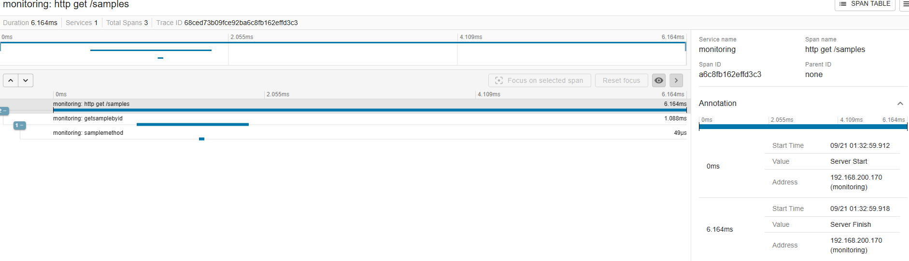

# Micrometer 를 이용한 모니터링 테스트

Micrometer 는 JVM 기반 애플리케이션을 위한 애플리케이션 성능 모니터링 라이브러리입니다. 

다양한 모니터링 시스템과 통합할 수 있는 추상화 계층을 제공하여, 개발자가 특정 모니터링 시스템에 종속되지 않고도 애플리케이션의 메트릭을 수집하고 보고할 수 있도록 합니다.

### 🔨 Gradle 설정

💡 HttpRequest Sample 사용을 위해선 1.1.4 이하의 버전을 사용해야 합니다.

해당 버전과 호환되는 Spring Boot 버전은 3.2.5 이하입니다.

```groovy
dependencies {
    // monitoring 
    implementation("io.micrometer:micrometer-tracing:1.1.4")
    implementation("io.micrometer:micrometer-tracing-bridge-brave:1.1.4")
    // for report
    implementation("io.zipkin.reporter2:zipkin-reporter-brave")
    // (선택사항) Slack 에러 전송용 logback appender
    implementation("com.cyfrania:logback-slack-appender:1.2")
}
```

### 리포트를 받을 Zipkin 서버 설정 (windows)

[zipkin 공식문서](https://zipkin.io/pages/quickstart.html)

`Git Bash` 혹은 `WSL` 에서 아래 명령어로 zipkin 서버를 실행합니다.

여기서는 간단하게 docker 없이 jar 파일로 실행하는 방법을 소개합니다.

`Git Bash` 를 열고 jar 를 다운로드

```bash
curl -sSL https://zipkin.io/quickstart.sh | bash -s io.zipkin:zipkin-server:2.26.0:exec zipkin.jar
```

다운로드가 완료되면 해당 폴더에서 (혹은 파일을 옮긴 후)

```bash
java -jar zipkin.jar
```

실행이 되면 기본적으로 http://localhost:9411/zipkin/ 에서 zipkin 서버에 접속할 수 있습니다.

이후 Controller 및 Service 에서 메트릭을 수집하는 코드를 작성합니다.

### `yaml` 설정

```yaml
management:
  server:
    port: 9292
    address: 127.0.0.1
  tracing:
    enabled: true
    sampling:
      # 샘플링 비율 설정 (0.0 ~ 1.0)
      # 운영환경에서는 0.1 ~ 0.3 등 비율을 조절 하여 설정
      probability: 1.0
  zipkin:
    tracing:
      endpoint: http://localhost:9411/api/v2/spans
```

### 🚀 간단 실행

`profile` 을 `locals` 로 설정하고 boot 를 실행합니다.

```bash
./gradlew bootRun --args='--spring.profiles.active=locals'
```

### trace 방법

기본적으로 아래의 항목은 자동 추적됩니다.
- HTTP 요청 (Spring MVC, WebFlux)
- HTTP 클라이언트 (RestTemplate, WebClient, Feign)
- 데이터베이스 쿼리 (JDBC, JPA, R2DBC)
- 메시징 (RabbitMQ, Kafka)
- 캐시 (Redis, 기타 Cache providers)

필요시 커스텀 스팬 추가

```java
import brave.Span;
import brave.Tracer;
// 기타 import 생략

@RequiredArgsConstructor
@Service
public class YourService {

    private final Tracer tracer;

    public void yourMethod() {
		// 기본 메서드 호출은 자동 트레이싱되지 않으므로
		// 필요한 경우에만 수동으로 스팬 추가
		Span span = tracer.nextSpan()
			.name("business-logic-processing")
			.tag("order.id", order.getId().toString())
			.start();
		        try (Tracer.SpanInScope ws = tracer.withSpanInScope(span)) {
            // 비즈니스 로직 수행
            processBusinessLogic();
        } catch (Exception e) {
            span.error(e);
            throw e;
        } finally {
			span.finish();
		}
    }
}
```

자세한 사용법은 [Micrometer Tracing 공식문서](https://micrometer.io/docs/tracing) 참고

- 좀 더 학습이 필요

### zapkin 서버 접속

zipkin 서버 접속 후 trace 결과를 확인

